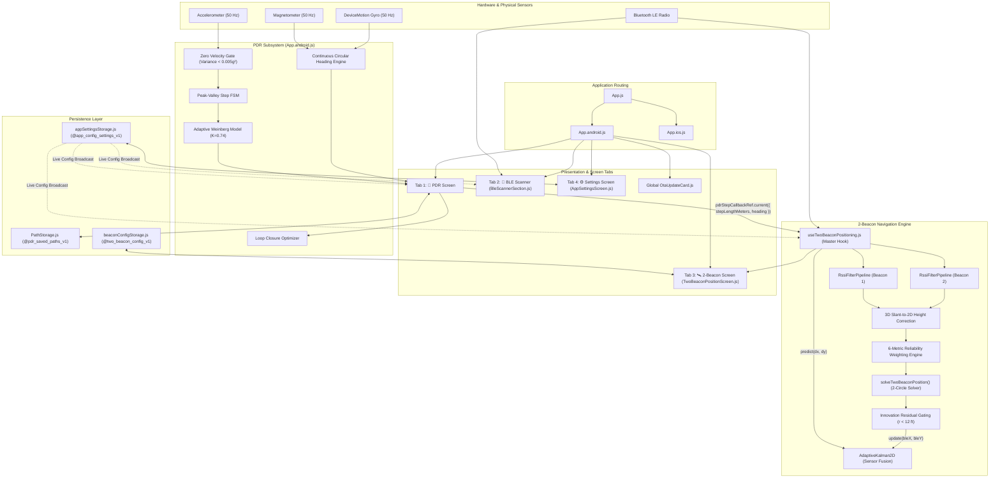

# 01. Architecture, File Connections & UI Wireframes

This document provides a professional, end-to-end technical reference for the **Indoor Navigation & PDR (Pedestrian Dead Reckoning)** system. It documents the component hierarchy, data pipelines, hardware abstractions, and UI wireframes across all modules.

---

## 1. Project Directory Structure

```text
PDR_ExpoGo/
├── App.js                                # Cross-platform entry router (iOS vs Android)
├── App.android.js                        # Android navigation hub (Tabs: PDR, BLE Scan, 2-Beacon, Settings)
├── App.ios.js                            # iOS navigation hub (Tabs: PDR, BLE Scan, Settings)
├── PathStorage.js                        # Persistent local storage for PDR paths (AsyncStorage)
├── package.json                          # Dependencies (Expo SDK 54, React Native 0.81, BLE-PLX, SVG)
├── app.json                              # Expo native manifest, permissions & EAS update configuration
├── eas.json                              # EAS Cloud Build & OTA update channel profiles
│
├── components/
│   ├── AppSettingsScreen.js              # In-app runtime parameter tuning panel (⚙️ Settings tab)
│   ├── BeaconDebugPanel.js               # Real-time mathematical diagnostic panel
│   ├── BleDistanceRssiTestPanel.js       # Live Distance vs RSSI testing & scatter/time-series suite
│   ├── BleScannerSection.js              # BLE discovery tool, iBeacon decoder, search bar, 1€-filter
│   ├── CalibrationPanel.js               # 1-meter live RSSI calibration panel (Stage 3)
│   ├── OtaUpdateCard.js                  # Global EAS Over-The-Air update status & reload card
│   ├── TestAreaMap.js                    # Interactive SVG indoor room map with PanResponder
│   └── TwoBeaconPositionScreen.js        # 4-stage 2-Beacon Indoor Positioning wizard
│
├── hooks/
│   └── useTwoBeaconPositioning.js        # Master hook driving 10Hz calculation loop & sensor fusion
│
├── services/
│   ├── BleScannerService.js              # BLE native manager, iBeacon/Eddystone decoder, One-Euro filter
│   ├── RttRangingService.js              # Round-Trip-Time (RTT) ranging & hardware offset calibrator
│   ├── appSettingsStorage.js             # Local persistence & live subscription for app settings
│   ├── beaconConfigStorage.js            # Configuration storage for 2-beacon map positions
│   └── twoBeaconServices.js              # 2D positioning models, 2-circle solver, Adaptive Kalman
│
└── knowledge base/                       # System engineering specifications & documentation
    ├── 01_architecture_file_connections_and_wireframes.md
    ├── 02_core_logic_algorithms_and_math.md
    └── 03_codebase_critique_and_improvements.md
```

---

## 2. File Inventory & Module Responsibilities

### 2.1 Application Entry & Navigation Layer

| File | Primary Responsibility | Key Exports & Data Interfaces |
| :--- | :--- | :--- |
| [`App.js`](file:///c:/Users/harsh.p/Desktop/Indoor%20Navigation/PDR_ExpoGo/App.js) | Root router. Detects `Platform.OS` and renders [`App.android.js`](file:///c:/Users/harsh.p/Desktop/Indoor%20Navigation/PDR_ExpoGo/App.android.js) or [`App.ios.js`](file:///c:/Users/harsh.p/Desktop/Indoor%20Navigation/PDR_ExpoGo/App.ios.js). | Default `App()` component |
| [`App.android.js`](file:///c:/Users/harsh.p/Desktop/Indoor%20Navigation/PDR_ExpoGo/App.android.js) | Android master screen. Implements 50 Hz accelerometer FSM, ZUPT stationary gate, Weinberg dynamic stride calculation, circular heading engine, loop closure, and tab navigation between **`pdr`**, **`ble`**, **`beacon`**, and **`settings`**. | Default `AppAndroid()` component |
| [`App.ios.js`](file:///c:/Users/harsh.p/Desktop/Indoor%20Navigation/PDR_ExpoGo/App.ios.js) | iOS master screen. Mirrors the PDR and BLE capabilities of Android. | Default `AppIOS()` component |

### 2.2 Storage & Persistence Layer

| File | Primary Responsibility | Storage Key | Key Exports |
| :--- | :--- | :--- | :--- |
| [`PathStorage.js`](file:///c:/Users/harsh.p/Desktop/Indoor%20Navigation/PDR_ExpoGo/PathStorage.js) | Persists user-recorded PDR walking paths with step counts, timestamps, and coordinate arrays. Memory fallback included. | `@pdr_saved_paths_v1` | `getSavedPaths()`, `savePath()`, `deleteSavedPath()`, `clearAllSavedPaths()` |
| [`services/beaconConfigStorage.js`](file:///c:/Users/harsh.p/Desktop/Indoor%20Navigation/PDR_ExpoGo/services/beaconConfigStorage.js) | Persists 2-Beacon setup data (selected beacon IDs, beacon names, room coordinates, calibrated TxPower, path-loss exponent $n$, and 3D height settings). | `@two_beacon_config_v1` | `DEFAULT_CONFIG`, `loadBeaconConfig()`, `saveBeaconConfig()`, `resetBeaconConfig()` |
| [`services/appSettingsStorage.js`](file:///c:/Users/harsh.p/Desktop/Indoor%20Navigation/PDR_ExpoGo/services/appSettingsStorage.js) | Centralized, persistent configuration engine for tuning all app parameters (PDR thresholds, BLE filters, room size, RTT offsets) live without rebuilding. | `@app_config_settings_v1` | `DEFAULT_APP_SETTINGS`, `loadAppSettings()`, `saveAppSettings()`, `getAppSettings()`, `subscribeAppSettings()` |

### 2.3 Services & Mathematical Algorithms

| File | Primary Responsibility | Key Mathematical Models & Exports |
| :--- | :--- | :--- |
| [`services/BleScannerService.js`](file:///c:/Users/harsh.p/Desktop/Indoor%20Navigation/PDR_ExpoGo/services/BleScannerService.js) | Native BLE scanning via `react-native-ble-plx`. Implements automated **Apple iBeacon & Google Eddystone payload decoding**, 5-stage signal filtering, One-Euro adaptive low-pass filter, Log-Distance Path Loss, and near-field touch curve. | `getBleManager()`, `parseBeaconPayload()`, `base64ToBytes()`, `OneEuroFilter`, `DeviceDistanceTracker`, `calculateDistance()`, `requestBluetoothPermissions()`, `ensureBluetoothEnabled()` |
| [`services/twoBeaconServices.js`](file:///c:/Users/harsh.p/Desktop/Indoor%20Navigation/PDR_ExpoGo/services/twoBeaconServices.js) | Analytical 2-circle intersection solver, 3D slant-to-horizontal height correction, multi-factor reliability weighting, Innovation Residual Gating, and `AdaptiveKalman2D`. | `feetToScreen()`, `screenToFeet()`, `clampToRoom()`, `RssiFilterPipeline`, `rssiToDistance()`, `applyHeightCorrection()`, `computeWeight()`, `solveTwoBeaconPosition()`, `AdaptiveKalman2D` |
| [`services/RttRangingService.js`](file:///c:/Users/harsh.p/Desktop/Indoor%20Navigation/PDR_ExpoGo/services/RttRangingService.js) | Round-Trip-Time (RTT) ranging simulation, hardware offset calibration, Hampel / MAD outlier filtering, and MAE / RMSE accuracy statistics. | `DeviceRttTracker`, `calculateRttDistanceNs()`, `calculateCalibrationOffsetNs()`, `calculateMAE()`, `calculateRMSE()` |

### 2.4 State Management & Hooks

| File | Primary Responsibility | Data Streams Handled |
| :--- | :--- | :--- |
| [`hooks/useTwoBeaconPositioning.js`](file:///c:/Users/harsh.p/Desktop/Indoor%20Navigation/PDR_ExpoGo/hooks/useTwoBeaconPositioning.js) | Central React hook orchestrating the 2-Beacon module. Runs a continuous 10 Hz positioning calculation loop, 20 FPS UI refresh, receives PDR step callbacks via `pdrStepCallbackRef`, feeds Kalman prediction/updates, and exports benchmark logs. | Discovered devices, filtered RSSI, estimated $(x, y)$ positions, historical trail, debug metrics, and CSV/JSON log export |

### 2.5 Presentation & UI Components

| Component | Screen / Context | Key Features |
| :--- | :--- | :--- |
| [`components/BleScannerSection.js`](file:///c:/Users/harsh.p/Desktop/Indoor%20Navigation/PDR_ExpoGo/components/BleScannerSection.js) | 📶 **BLE Scanner Tab** | Native continuous scanning, live search bar, strongest-first RSSI sorting, iBeacon tags, and **Focused Target Testing Dashboard** with live SVG distance graphs. |
| [`components/TwoBeaconPositionScreen.js`](file:///c:/Users/harsh.p/Desktop/Indoor%20Navigation/PDR_ExpoGo/components/TwoBeaconPositionScreen.js) | 🛰️ **2-Beacon Tab** | 4-Stage Wizard container (**Select** $\rightarrow$ **Place** $\rightarrow$ **Calibrate** $\rightarrow$ **Position Test**) with stage indicators and test controls. |
| [`components/TestAreaMap.js`](file:///c:/Users/harsh.p/Desktop/Indoor%20Navigation/PDR_ExpoGo/components/TestAreaMap.js) | 🛰️ **2-Beacon Tab (Stages 2 & 4)** | Interactive SVG room map (customizable dimensions). Supports dragging beacons via `PanResponder`, 3 ft grid lines, user cursor with orientation heading arrow, history trails, and debug markers. |
| [`components/CalibrationPanel.js`](file:///c:/Users/harsh.p/Desktop/Indoor%20Navigation/PDR_ExpoGo/components/CalibrationPanel.js) | 🛰️ **2-Beacon Tab (Stage 3)** | 3-second live RSSI sampling at 1 meter, automatic median TxPower calculation, and path-loss exponent $n$ slider. |
| [`components/BeaconDebugPanel.js`](file:///c:/Users/harsh.p/Desktop/Indoor%20Navigation/PDR_ExpoGo/components/BeaconDebugPanel.js) | 🛰️ **2-Beacon Tab (Stage 4)** | Real-time diagnostic telemetry: raw RSSI, filtered RSSI, distances, weights, confidence score, BLE vs PDR vs Fused coordinates, and ground truth error. |
| [`components/BleDistanceRssiTestPanel.js`](file:///c:/Users/harsh.p/Desktop/Indoor%20Navigation/PDR_ExpoGo/components/BleDistanceRssiTestPanel.js) | 📶 **BLE Scanner Tab (Focused Mode)** | Interactive distance vs RSSI scatter plot, time-series comparison plots, zoom in/out, and auto-fit features. |
| [`components/AppSettingsScreen.js`](file:///c:/Users/harsh.p/Desktop/Indoor%20Navigation/PDR_ExpoGo/components/AppSettingsScreen.js) | ⚙️ **Settings Tab** | Live parameter tuning for BLE path-loss, dead zone, near-field curves, One-Euro filter, Weinberg stride factor, step thresholds, cadence, and room dimensions. |
| [`components/OtaUpdateCard.js`](file:///c:/Users/harsh.p/Desktop/Indoor%20Navigation/PDR_ExpoGo/components/OtaUpdateCard.js) | Global (All Tabs) | EAS OTA update status badge, remote bundle download, and one-tap app reload. |

---

## 3. High-Level System Architecture Diagram



---

## 4. Cross-Module Data Pipelines & Lifecycles

### 4.1 High-Rate PDR Step Injection Pipeline
1. **Sensor Ingestion (50 Hz)**: Accelerometer and Gyroscope poll continuously via `expo-sensors`.
2. **Dynamic Gravity Elimination**: Low-pass filter extracts gravity vector, isolating pure dynamic body acceleration.
3. **ZUPT Validation**: Variance gate confirms user is in active locomotion ($\sigma^2 \ge 0.005\text{ g}^2$).
4. **FSM Step Confirmation**: Step state machine confirms heel-strike and swing-phase rebound.
5. **Weinberg Stride Length**: Dynamic step length ($SL$) is calculated from vertical bounce amplitude ($K=0.74$).
6. **Bridge Callback**: `pdrStepCallbackRef.current({ stepLengthMeters: len, heading: curHeading })` fires.
7. **Kalman Prediction**: [`hooks/useTwoBeaconPositioning.js`](file:///c:/Users/harsh.p/Desktop/Indoor%20Navigation/PDR_ExpoGo/hooks/useTwoBeaconPositioning.js) receives the step, computes:
   $$\Delta x = SL \cdot \sin(\theta), \quad \Delta y = SL \cdot \cos(\theta)$$
   and calls `kalmanRef.current.predict(dx, dy)`.

### 4.2 BLE Packet Ingestion & Payload Decoding Pipeline
1. **Radio Scan**: Native hardware scan captures advertising packets via `react-native-ble-plx`.
2. **Payload Parsing**: `parseBeaconPayload()` inspects base64 Manufacturer Data:
   - Matches Apple iBeacon identifier (`0x004C 0x02 0x15`).
   - Decodes 16-byte UUID, 2-byte Major, 2-byte Minor, and 1-byte TxPower.
   - Names the device automatically to bypass text-name filtering.
3. **Outlier Filtering**: Packets outside $[-105, -5]\text{ dBm}$ are dropped.
4. **Median & One-Euro Smoothing**: 5-sample rolling median removes channel hopping; One-Euro filter eliminates stationary jitter.
5. **Distance Calculation**: Log-Distance Path Loss equation with near-field saturation curve ($0\text{ cm} \rightarrow -43\text{ dBm}$) calculates physical meters.
6. **Rate Limiting**: Kinematic ceiling limits maximum displacement per cycle to realistic walking speeds.

### 4.3 2-Beacon Trilateral Positioning & Kalman Fusion Pipeline
1. **Height Correction**: Both beacon slant-ranges are converted to true 2D floor distances using ceiling and phone elevation.
2. **Analytical Intersection**: 2-circle intersection calculates candidate coordinates $P_1$ and $P_2$.
3. **Disambiguation**: Selects candidate inside room bounds, with historical movement proximity fallback.
4. **Innovation Residual Gating**: Rejects BLE estimates that jump $> 12\text{ ft}$ from current predicted position.
5. **Kalman Measurement Update**: Validated BLE measurement updates the state vector $[x, y]^T$ with dynamic confidence scaling ($0.0 - 1.0$).
6. **UI Refresh (20 FPS)**: Renders smoothed fused cursor on the SVG interactive room map.

---

## 5. UI Screen Wireframes & Component Layouts

### 5.1 Tab 1: Pedestrian Dead Reckoning (`App.android.js`)

```text
┌─────────────────────────────────────────────────────────────┐
│ [👣 PDR]   [📶 BLE Scanner]   [🛰️ 2-Beacon]   [⚙️ Settings] │
├─────────────────────────────────────────────────────────────┤
│ 📋 Hardware Sensors Status: Ready (Android)                 │
├──────────────────────────────┬──────────────────────────────┤
│ Steps: 42                    │ Heading: +34.2° (NE)         │
├──────────────────────────────┼──────────────────────────────┤
│ X Position: +3.82 m          │ Y Position: +5.41 m          │
├──────────────────────────────┼──────────────────────────────┤
│ Total Distance: 29.40 m      │ Dynamic Step Length: 0.72 m  │
├──────────────────────────────┴──────────────────────────────┤
│ 📐 Interactive 2D Path Visualizer (SVG Canvas)              │
│ ┌─────────────────────────────────────────────────────────┐ │
│ │                  N (+Y)                                 │ │
│ │                    ▲                                    │ │
│ │                    │         ● [Current Pos (3.8, 5.4)] │ │
│ │                    │        /                           │ │
│ │                    │       /  ▲ Heading Cone            │ │
│ │ W (-X) ────────────┼───────●────► E (+X)                │ │
│ │                    │      /                             │ │
│ │                    │     ●                              │ │
│ │                    │    /                               │ │
│ │                    │   ● [Start (0,0)]                  │ │
│ │                    ▼                                    │ │
│ │                  S (-Y)                                 │ │
│ └─────────────────────────────────────────────────────────┘ │
├─────────────────────────────────────────────────────────────┤
│ [▶ Start Walking]   [⏹ Stop]   [🔄 Reset]   [🎯 Set Zero]   │
├─────────────────────────────────────────────────────────────┤
│ [🔁 Loop Closure Correction]   [💾 Save Recorded Path]      │
└─────────────────────────────────────────────────────────────┘
```

### 5.2 Tab 2: BLE Scanner & Focused Target Suite (`BleScannerSection.js`)

```text
┌─────────────────────────────────────────────────────────────┐
│ [👣 PDR]   [📶 BLE Scanner]   [🛰️ 2-Beacon]   [⚙️ Settings] │
├─────────────────────────────────────────────────────────────┤
│ Fast & Smooth BLE Distance               Bluetooth: PoweredOn│
│ 50ms Low-Latency Scanning • Live 20 FPS                      │
├─────────────────────────────────────────────────────────────┤
│ [  Start BLE Scan  ]               [  Clear Device List  ]  │
├─────────────────────────────────────────────────────────────┤
│ 🔍 [ Search name, MAC (e.g. C4:64) or UUID...             ] │
├─────────────────────────────────────────────────────────────┤
│ [X] Named Only      Tracking: 3 devices (Total: 12)         │
├─────────────────────────────────────────────────────────────┤
│ 🎯 iBeacon (M:1 m:1)  [iBeacon]                 -38 dBm     │
│ MAC: C4:64:E3:21:44:A2                                      │
│ UUID: 29394DEC-BCFD-4464-A5FA-1370DF31AB33                  │
│ Major: 1 | Minor: 1 | Calibrated: -59 dBm                   │
│ ┌─────────────────────────────────────────────────────────┐ │
│ │ DISTANCE: 0.42 m (1.38 ft)           Signal: Excellent  │ │
│ │ Trend: 🟢 Approaching                Status: ⚡ Fast Lock│ │
│ └─────────────────────────────────────────────────────────┘ │
│ [ 🎯 Focus Target Testing ]                                 │
├─────────────────────────────────────────────────────────────┤
│ BLE Device (9E:1B)                              -78 dBm     │
│ MAC: F2:11:44:88:9E:1B                                      │
│ DISTANCE: 4.85 m (15.91 ft)            Signal: Fair         │
│ [ 🎯 Focus Target Testing ]                                 │
└─────────────────────────────────────────────────────────────┘
```

### 5.3 Tab 3: 2-Beacon Indoor Positioning (`TwoBeaconPositionScreen.js`)

```text
┌─────────────────────────────────────────────────────────────┐
│ [👣 PDR]   [📶 BLE Scanner]   [🛰️ 2-Beacon]   [⚙️ Settings] │
├─────────────────────────────────────────────────────────────┤
│  (1) Select    ───►  (2) Place   ───►  (3) Calibrate  ───►  │
│    Beacons              Beacons              (1m RSSI)      │
│  [  Active  ]         [ Step 2 ]            [ Step 3 ]      │
├─────────────────────────────────────────────────────────────┤
│ Selected Beacons Summary:                                   │
│ [B1] Moko-Beacon-1 (C4:64:E3:21:44:A2)         [ Change ]   │
│ [B2] Moko-Beacon-2 (E8:22:90:11:7B:04)         [ Change ]   │
├─────────────────────────────────────────────────────────────┤
│ Stage 4: Live Position Test & Sensor Fusion Map             │
│ Room Size: 18.0 ft × 15.0 ft                                │
│ ┌─────────────────────────────────────────────────────────┐ │
│ │ [B1 (0, 15)]                      [B2 (18, 15)]         │ │
│ │   ●                                 ●                   │ │
│ │    \                               /                    │ │
│ │     \                             /                     │ │
│ │      \                           /                      │ │
│ │       \            ● (Fused)    /                       │ │
│ │        \          /            /                        │ │
│ │         \        /            /                         │ │
│ │          \      ● (BLE)      /                          │ │
│ │                                                         │ │
│ │                      ● (PDR)                            │ │
│ └─────────────────────────────────────────────────────────┘ │
│ Legend: 🟢 Fused Position   🔵 BLE Measured   🟣 PDR Stride │
├─────────────────────────────────────────────────────────────┤
│ [ ▶ Start Position Test ]           [ 📊 Export Dataset ]   │
└─────────────────────────────────────────────────────────────┘
```

### 5.4 Tab 4: In-App Configuration Engine (`AppSettingsScreen.js`)

```text
┌─────────────────────────────────────────────────────────────┐
│ [👣 PDR]   [📶 BLE Scanner]   [🛰️ 2-Beacon]   [⚙️ Settings] │
├─────────────────────────────────────────────────────────────┤
│ ⚙️ CONFIG ENGINE — Live Runtime Tuning                      │
│ Modify parameters live without recompiling or redeploying.  │
├─────────────────────────────────────────────────────────────┤
│ 📶 BLE DISTANCE & PATH LOSS MODEL                           │
│ 1m Measured Power (TxPower): [-59   ] dBm                   │
│ Environmental Path Loss (n): [2.2   ]                       │
│ Dead-Zone Threshold (m):     [0.03  ] m                     │
│ 1€ Filter Baseline Cutoff:   [0.35  ] Hz                    │
│ 1€ Filter Beta Factor:       [0.06  ]                       │
├─────────────────────────────────────────────────────────────┤
│ 🎯 NEAR-FIELD TOUCH CORRECTION                              │
│ Enable 0cm Touch Curve:      [ Toggle ON ]                  │
│ Saturation Threshold RSSI:   [-43   ] dBm                   │
├─────────────────────────────────────────────────────────────┤
│ 👣 PDR & STEP DETECTOR THRESHOLDS                           │
│ Weinberg Stride Factor (K):  [0.74  ]                       │
│ ZUPT Stationary Gate:        [0.005 ] g²                    │
│ Heel-Strike Peak Threshold:  [0.12  ] g                     │
│ Swing-Phase Valley Threshold:[-0.09 ] g                     │
├─────────────────────────────────────────────────────────────┤
│ 🏠 ROOM & MAP ENVIRONMENT                                   │
│ Room Width (X axis):         [18.0  ] ft                    │
│ Room Height (Y axis):        [15.0  ] ft                    │
├─────────────────────────────────────────────────────────────┤
│ [ 💾 Save All Settings ]             [ 🔄 Reset Defaults ]  │
└─────────────────────────────────────────────────────────────┘
```
